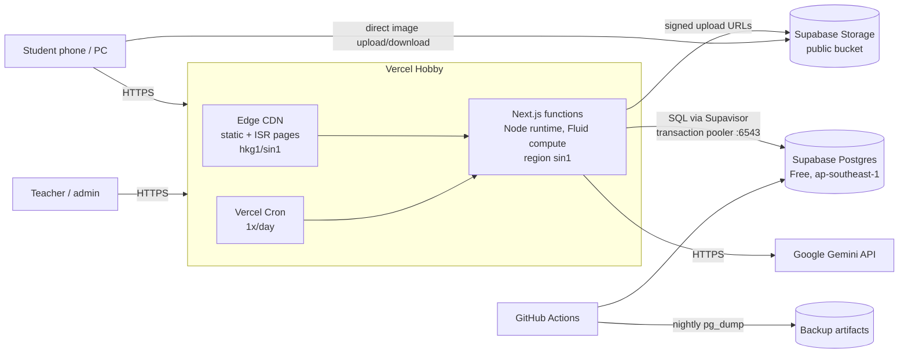
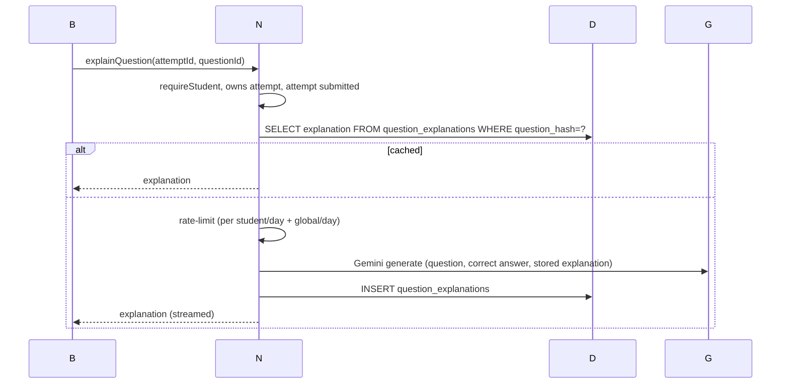

# 02 — Architecture

## 1. System context



**One deployable app.** Frontend and backend live in one Next.js project, which is what you have today but without Express. The "backend" is:
- **React Server Components (RSC)** for reads. They query the DB on the server and stream HTML.
- **Server Actions** for mutations such as submitting a test, approving a student or saving a lesson.
- **Route Handlers** (`app/api/**/route.ts`) only where a plain HTTP endpoint is needed: streaming AI output, cron, health check, signed-upload URLs, the `sendBeacon` autosave.

## 2. Tech stack

| Layer | Choice | Why (details in `adr/`) |
|---|---|---|
| Framework | **Next.js, latest stable (16.x at time of writing), App Router, TypeScript strict** | Native on Vercel, RSC + Server Actions remove the need for a separate API server. ADR-001 |
| Runtime | Node.js runtime (not Edge) for all DB/auth code; Fluid compute on | Full Node APIs (bcrypt, postgres), connections reused within an instance |
| UI | React 19, **Tailwind CSS v4**, **shadcn/ui** (Radix primitives, code copied into the repo), **lucide-react** icons | Accessible primitives, no runtime CSS-in-JS, tree-shaken icons replace Font Awesome |
| Fonts | `next/font` self-hosted **Be Vietnam Pro** (UI) + **JetBrains Mono** (numbers/timer) | Full Vietnamese diacritics, no layout shift, no third-party font requests |
| Math | **KaTeX**, rendered **on the server** (`renderToString`) | No KaTeX JS on the client, only its CSS and fonts |
| DB access | **Drizzle ORM** + `postgres` (postgres.js) through the **Supabase transaction pooler** (`:6543`, `prepare: false`) | Typed schema in repo, SQL-like API, migrations, serverless-safe pooling. ADR-002 |
| Validation | **Zod** schemas shared by forms and server actions | One source of truth |
| Auth | Custom session auth: `sessions` table + httpOnly cookie, `bcryptjs` | Needs phone login, approval, device binding and single session, which off-the-shelf providers handle poorly. ADR-003 |
| Client state | React state + `useActionState`; **Zustand** only in the quiz runner (persisted to localStorage) | Little global state needed |
| Charts | **Recharts**, admin and profile only, lazy-loaded | Keeps it out of the main student bundle |
| AI | `@google/genai` (Gemini), model name from env | Same provider as v1, free tier. See 09 |
| Storage | Supabase Storage, public bucket `media`, uploads resized to WebP in the browser | No function bandwidth, no Vercel image-optimization quota. ADR-006 |
| Rate limiting | Postgres fixed-window counter (`rate_limits` table) | No extra service |
| Package manager | **pnpm**; Node 22 LTS | |
| Lint/format | **Biome** | One fast tool |
| Tests | **Vitest** (unit/integration), **Playwright** (E2E), **k6** (load) | See 11 |

## 3. Rendering & caching strategy (the main lever for speed and cost)

Rule: **do as little work per request as possible, and do it once for everyone when you can.**

| Route | Rendering | Data cache | Invalidation |
|---|---|---|---|
| `/` landing, `/ly-thuyet/**` materials, `/gallery`, `/about` | **Static** (built at deploy) | — | Redeploy |
| `/share/lessons/[id]` | **ISR** | `lesson:{id}` tag | `revalidateTag` on lesson save |
| `/lessons` catalog | Dynamic shell. The lesson list comes from **cached data** (`"use cache"`, tag `lessons`); per-student progress is a separate small query streamed in via `<Suspense>` | `lessons` | on any lesson publish/edit |
| `/lessons/[id]` overview | Dynamic. Lesson meta cached (`lesson:{id}`), student's attempts uncached | `lesson:{id}` | on save |
| `/attempts/[id]` test runner | Dynamic. Questions come from a cached, **answer-stripped** lesson snapshot + the attempt row | `lesson:{id}:public` | on save |
| `/attempts/[id]/result` | Dynamic (owner only), finished attempts are immutable → cached per attempt | `attempt:{id}` | on delete |
| `/leaderboard` | Cached **60 s** (`cacheLife`), shared by all users | `leaderboard` | time-based + on attempt delete |
| `/profile`, `/review`, `/dashboard` | Dynamic, per user | — | — |
| `/admin/**` | Dynamic, no cache | — | — |

Notes:
- Answers, meaning `answer` fields and explanations, are **never** in a cache entry that feeds student pages before submit. There are two separate cached shapes: `getLessonForTaking()` (stripped) and `getLessonWithAnswers()` (server-only, used by grading).
- Grading reads `getLessonWithAnswers(id, version)`. It's cached, so a burst of 100 submits reads the lesson once per instance, not 100 times from the DB.
- `<Link prefetch>`: keep the default for navigation, but set `prefetch={false}` on long lists of lesson cards so that scrolling doesn't fire dozens of RSC requests (quota, see 08).
- Static assets (JS/CSS/fonts) come from `/_next/static` with `immutable`, 1-year cache. That fixes the v1 `max-age=0` problem.

## 4. Key flows

### 4.1 Take a test (server-authoritative)

```mermaid
sequenceDiagram
  participant B as Browser
  participant N as Next.js (sin1)
  participant D as Postgres
  B->>N: Server Action startAttempt(lessonId)
  N->>N: requireStudent(); rate-limit
  N->>D: find in-progress attempt for (student, lesson)
  alt exists and not expired
    N-->>B: redirect /attempts/{id}
  else
    N->>N: getLessonWithAnswers (cached)\npick pool, shuffle with seed
    N->>D: INSERT attempt(question_ids, option_orders, seed, deadline_at, lesson_version)
    N-->>B: redirect /attempts/{id}
  end
  B->>N: GET /attempts/{id} (RSC)
  N-->>B: questions WITHOUT answers, deadline, saved answers
  loop every change
    B->>B: save answers to localStorage
  end
  loop every 30 s / visibilitychange=hidden
    B->>N: saveProgress(attemptId, answers, flags) (beacon/action)
    N->>D: UPDATE attempt SET answers, guard_flags WHERE status='in_progress'
  end
  B->>N: submitAttempt(attemptId, answers, clientSubmitId)
  N->>D: SELECT ... FOR UPDATE attempt
  N->>N: grade(answers, lessonWithAnswers) — pure function
  N->>D: tx: UPDATE attempt (score, per-question marks, status='submitted')\n+ UPDATE ratings + INSERT rating_events + UPSERT mistakes
  N->>N: revalidateTag(leaderboard) (lazy: 60 s TTL is enough)
  N-->>B: redirect /attempts/{id}/result
```

Properties:
- **Idempotent submit.** The row lock plus the `status` check means a double-click or a retry after a timeout gives the same result.
- **Deadline enforced on the server.** `deadline_at + 30 s grace`. Late submits are graded with the last saved answers.
- **Lesson versioning.** An attempt stores `lesson_version`. If the teacher edits a lesson mid-attempt, grading uses the version the student saw. Old versions stay in `lesson_versions`, which keeps a snapshot of the questions JSON.

### 4.2 AI explanation



### 4.3 Admin publishes a lesson
Editor (client) parses the text format live → `saveLesson` action validates with Zod → `INSERT lesson_versions` + `UPDATE lessons SET current_version` → `revalidateTag('lessons')`, `revalidateTag('lesson:{id}')`, `revalidateTag('lesson:{id}:public')`.

## 5. Repository layout

```
onluyenvatly-v2/
├─ docs/                       ← these documents
├─ src/
│  ├─ app/
│  │  ├─ (public)/             ← static/ISR: landing, ly-thuyet, gallery, share
│  │  ├─ (auth)/login, register
│  │  ├─ (student)/            ← layout calls requireStudent()
│  │  │  ├─ dashboard/
│  │  │  ├─ lessons/  lessons/[id]/
│  │  │  ├─ attempts/[id]/  attempts/[id]/result/
│  │  │  ├─ review/  leaderboard/  profile/  settings/
│  │  ├─ admin/                ← layout calls requireAdmin()
│  │  │  ├─ page.tsx (dashboard) lessons/ lessons/[id]/edit students/ results/ settings/
│  │  ├─ api/
│  │  │  ├─ ai/import/route.ts        (streaming)
│  │  │  ├─ attempts/[id]/beacon/route.ts
│  │  │  ├─ cron/daily/route.ts
│  │  │  └─ health/route.ts
│  │  ├─ layout.tsx  globals.css  manifest.ts  robots.ts  sitemap.ts
│  ├─ features/               ← domain modules; each has queries.ts, actions.ts, components/, *.test.ts
│  │  ├─ auth/  lessons/  attempts/  grading/  rating/  review/
│  │  ├─ leaderboard/  students/  stats/  ai/  media/  settings/  audit/
│  ├─ components/ui/           ← shadcn primitives
│  ├─ components/              ← shared app components (MathText, QuestionCard, AppShell…)
│  ├─ db/
│  │  ├─ schema.ts  client.ts  migrations/
│  ├─ lib/                     ← env.ts (zod-validated), cache-tags.ts, rate-limit.ts, dates.ts, logger.ts
│  └─ content/ly-thuyet/       ← MDX materials
├─ scripts/  migrate-legacy.ts  seed.ts  backup.sh  check-quotas.ts
├─ tests/  e2e/  load/ (k6)
├─ public/  (icons, og, handouts)
├─ drizzle.config.ts  next.config.ts  biome.json  vitest.config.ts  playwright.config.ts
└─ .github/workflows/  ci.yml  backup.yml  quota-check.yml
```

**Module rule:** `app/` files are thin. They call `features/*/queries.ts` (server-only reads) and `features/*/actions.ts` (`"use server"` mutations). Business logic such as grading, rating, points distribution, the text parser and pool selection lives in **pure functions** with no DB or Next imports, so it's easy to test.

## 6. Regions & latency
- Put the Vercel function region in **`sin1` (Singapore)**. v1 already runs there.
- The Supabase project must be in **`ap-southeast-1` (Singapore)**. Check the current project's region in Sprint 0. If it's elsewhere, create the v2 project in Singapore and migrate (see 10). DB round-trips should then be ~1–3 ms, versus 150+ ms cross-region.
- Students in Vietnam reach the Vercel edge in HKG/SIN in about 30–50 ms.

## 7. Configuration
All env vars are validated at boot by `src/lib/env.ts` (Zod). The build fails if any is missing. **There are no fallback secrets in code.**

| Var | Scope | Notes |
|---|---|---|
| `DATABASE_URL` | server | Supavisor transaction pooler URL (`:6543`) |
| `DATABASE_URL_DIRECT` | CI/scripts only | Direct/session URL for migrations and backups |
| `SUPABASE_URL`, `SUPABASE_SERVICE_ROLE_KEY` | server | Storage signed URLs only |
| `NEXT_PUBLIC_MEDIA_BASE_URL` | public | Public bucket base URL |
| `SESSION_PEPPER` | server | 32+ random bytes, used when hashing session tokens |
| `GEMINI_API_KEY`, `GEMINI_MODEL_TEXT`, `GEMINI_MODEL_IMPORT` | server | Models are configurable because free-tier models change |
| `CRON_SECRET` | server | Vercel cron auth |
| `AI_DAILY_BUDGET` | server | Global cap on Gemini calls per day |

## 8. What we are deliberately *not* adding
- No Redis/Upstash, no queue, no separate API server, no microservices. Postgres does it all at this scale.
- No Supabase Auth, no Realtime, no Edge Functions. That's less surface area and fewer quotas to watch.
- No Edge runtime middleware doing DB lookups. `proxy.ts` (formerly `middleware.ts`) only does a cheap cookie-presence check and redirect; real auth happens in layouts and actions.
