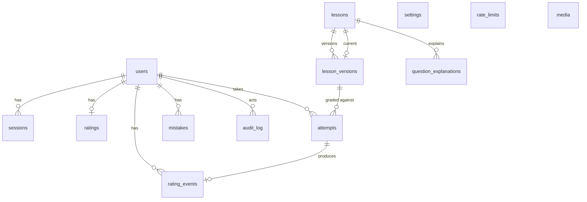

# 04 — Data Model

Postgres 15+ on Supabase. The schema is defined in `src/db/schema.ts` (Drizzle) and migrations live in `src/db/migrations/`. Naming: `snake_case` tables and columns, plural table names, `created_at`/`updated_at` everywhere, `timestamptz` always.

## 1. Entity overview



## 2. Tables

### `users`
| Column | Type | Notes |
|---|---|---|
| id | uuid PK default `gen_random_uuid()` | |
| legacy_id | text unique null | v1 `students.id` |
| role | enum `user_role` (`student`,`admin`) | |
| status | enum `user_status` (`pending`,`active`,`rejected`,`disabled`) | Only `active` can log in |
| full_name | text not null | |
| phone | text unique null | Normalized `0xxxxxxxxx` (10 digits). Required for students |
| username | text unique null | Admins may log in with a username |
| date_of_birth | date null | |
| grade | smallint null | 10/11/12, used for leaderboard filter |
| class_name | text null | e.g. `12A1` |
| password_hash | text not null | bcrypt `$2a/$2b$` |
| must_change_password | boolean default false | Set after an admin reset |
| avatar_path | text null | Storage path |
| approved_at, approved_by | timestamptz, uuid null | |
| last_login_at | timestamptz null | |
| created_at, updated_at | timestamptz | |

Indexes: `(status) WHERE status='pending'`, `(role)`, trigram on `unaccent(full_name)` for admin search (added in S2-01 together with the `unaccent`/`pg_trgm` extensions). Check constraints: `phone` or `username` is set; `grade` is 10–12.

### `sessions`
| Column | Type | Notes |
|---|---|---|
| id | text PK | `sha256(token ‖ SESSION_PEPPER)` hex. The raw token only exists in the cookie |
| user_id | uuid FK → users ON DELETE CASCADE | |
| expires_at | timestamptz | 30-day sliding |
| ip | inet null, user_agent text null | Shown in the "Phiên đăng nhập" (sessions) list |
| created_at, last_seen_at | timestamptz | `last_seen_at` is updated at most once per hour |

Index `(user_id)`, `(expires_at)`. The daily cron deletes expired rows.

### `settings` (single row, `id = 1`)
| Column | Type | Default |
|---|---|---|
| registration_open | boolean | true |
| single_session | boolean | true |
| ai_enabled | boolean | true |
| ai_daily_budget | int | 200 |
| announcement | text null | Banner on the dashboard |
| updated_at, updated_by | | |

### `lessons`
| Column | Type | Notes |
|---|---|---|
| id | bigint identity PK | Short URLs: `/lessons/123` |
| legacy_id | text unique null | v1 `Date.now()` IDs, used for redirects |
| title | text not null | |
| description | text null | |
| grade | smallint null | 10/11/12 |
| chapter | text null | e.g. "Dao động cơ" (was `subject`) |
| tags | text[] default `{}` | GIN index |
| cover_path | text null | |
| status | enum `lesson_status` (`draft`,`published`,`archived`) | |
| sort_order | int | Manual order |
| current_version_id | bigint FK → lesson_versions null | Published content |
| draft_version_id | bigint FK null | Work in progress |
| config | jsonb not null | `LessonConfig`, see §3.2 |
| question_count | smallint | Denormalized from the current version, after pool selection |
| type_counts | jsonb | `{mcq:18, tf:4, short:6}` for cards |
| attempt_count | int default 0 | Denormalized, updated on submit |
| search_text | text generated | `lesson_search_text(title, description, tags)` = `lower(immutable_unaccent(concat_ws(' ', title, description, array_to_string(tags, ' '))))`. Both helpers are `IMMUTABLE` SQL functions created in migration `0002_lessons` (with a pinned `search_path` so they work whether the extensions live in `public` or Supabase's `extensions` schema) |
| created_by | uuid FK | |
| created_at, updated_at, published_at | timestamptz | |

Indexes: `(status, sort_order)`, GIN `tags`, GIN trigram on `search_text`. Extensions `unaccent` + `pg_trgm` (also loaded by PGlite in tests and `pnpm db:local`).
Search: `WHERE search_text ILIKE '%' || lower(immutable_unaccent($q)) || '%'` using the trigram index, so it's accent-insensitive: "dao dong" matches "Dao động".

### `lesson_versions`
| Column | Type | Notes |
|---|---|---|
| id | bigint identity PK | |
| lesson_id | bigint FK → lessons ON DELETE CASCADE | |
| version | int | unique `(lesson_id, version)` |
| source_text | text | Editor text format (v1-compatible) |
| questions | jsonb | `Question[]`, see §3.1. **Includes answers**, so it's only read server-side |
| created_by, created_at | | |

**Versioning policy (keeps the DB small):** saving a draft overwrites the draft version in place. Publishing makes the draft current. A new version number is created only when the previous current version already has attempts. Versions with no attempts that aren't current or draft are pruned by the daily cron.

### `attempts`
| Column | Type | Notes |
|---|---|---|
| id | uuid PK | Unguessable, used in URLs |
| legacy_result_id | text unique null | |
| user_id | uuid FK → users ON DELETE CASCADE | |
| lesson_id | bigint FK null | null for personalized practice |
| lesson_version_id | bigint FK null | Version for single-lesson attempts (null for `review`, whose items carry `v`). `NO ACTION`, so a version in use can't be deleted except together with its lesson |
| mode | enum `attempt_mode` (`test`,`practice`,`review`) | `review` = personalized practice from mistakes |
| status | enum `attempt_status` (`in_progress`,`submitted`,`expired`) | |
| items | jsonb | Ordered `[{q:"q_ab12", v:57, o:[2,0,3,1], p:0.25}]`: question id, version id (omitted when equal to `lesson_version_id`), mcq option order, and the points fixed at start (so a config edit mid-attempt can't change the marks) |
| answers | jsonb | Array aligned with `items`: `"B"` \| `[true,false,null,true]` \| `"1,5"` \| `null` |
| flagged | smallint[] | Item indexes flagged for review |
| guard_events | jsonb | `[{t: 132, k: "blur"}]`, seconds since start + kind. Capped at 200 |
| earned | numeric(5,2)[] | Array aligned with `items`, set on submit |
| score | numeric(7,2) null | Sum of `earned` (7 digits: 200 questions × 100 points fits) |
| max_score | numeric(7,2) | |
| score10 | numeric(4,2) null | Normalized to 10 for display and stats |
| started_at | timestamptz | |
| deadline_at | timestamptz null | null = no limit |
| submitted_at | timestamptz null | |
| time_taken_sec | int null | |
| last_saved_at | timestamptz null | |
| client_submit_id | uuid null | Idempotency |
| ip | inet null | |

Check: `jsonb_array_length(answers) = jsonb_array_length(items)`. Drizzle maps the numeric columns to JS numbers (`mode: "number"`).

Indexes:
- `UNIQUE (user_id, lesson_id) WHERE status = 'in_progress'`: one open attempt per lesson.
- `(user_id, submitted_at DESC)` for history.
- `(lesson_id, submitted_at DESC) WHERE status='submitted'` for lesson stats.
- `(status, deadline_at) WHERE status='in_progress'` for the expiry sweep.

### `ratings`
`user_id` uuid PK FK, `rating` int default 1500, `peak` int, `rated_attempts` int, `updated_at`. Index `(rating DESC)`.

### `rating_events`
`id` bigint identity, `user_id`, `attempt_id` unique, `lesson_id`, `before` int, `delta` int, `after` int, `performance` numeric(4,3), `time_bonus` numeric(4,3) (null for migrated rows), `formula` text (`'v2'`, or `'v1-legacy'` for migrated rows), `created_at`. Index `(user_id, created_at DESC)`, `(created_at)` for "most improved this week".

v2 computes the delta from `performance` and `time_bonus` rounded to 3 decimals, exactly as stored, so replaying a student's events (delete attempt, 05) reproduces every delta. `ratings` rows are created at 1500 on the first rated submit and locked `FOR UPDATE` in the submit transaction, so two tests submitted at once both count, one after the other.

### `mistakes`
| Column | Type | Notes |
|---|---|---|
| user_id | uuid | PK part |
| lesson_id | bigint | PK part |
| question_id | text | PK part (stable id inside the lesson) |
| lesson_version_id | bigint | Latest version where it was seen |
| wrong_count | smallint | |
| correct_streak | smallint | Reset on a wrong answer |
| status | enum (`open`,`resolved`) | Resolved when `correct_streak >= 2` |
| last_attempt_id | uuid | |
| updated_at | timestamptz | |

Index `(user_id, status, updated_at DESC)`.

### `question_explanations`
`question_hash` text PK, `lesson_id`, `question_id`, `source` enum (`ai`,`teacher`), `model` text, `content_md` text, `votes_up`, `votes_down` int, `created_at`, `updated_at`.

### `rate_limits`
`key` text PK (e.g. `login:ip:1.2.3.4@10m`; the window is part of the key so one logical key can carry several limits), `window_start` timestamptz, `count` int. Identifiers such as phone numbers are hashed before they go into a key. Windows are fixed and UTC-aligned (`1m`, `10m`, `1h`, `1d`), computed in `src/lib/rate-limit.ts`.
Implemented as one atomic upsert:
```sql
INSERT INTO rate_limits(key, window_start, count) VALUES ($1, date_trunc('minute', now()), 1)
ON CONFLICT (key) DO UPDATE SET
  count = CASE WHEN rate_limits.window_start = excluded.window_start THEN rate_limits.count + 1 ELSE 1 END,
  window_start = excluded.window_start
RETURNING count;
```

### `media`
`id` uuid, `path` text unique, `bytes` int, `width`, `height` (null when unknown, e.g. migrated v1 files), `uploaded_by`, `created_at`. Used for the storage quota check and orphan cleanup.

### `audit_log`
`id` bigint, `actor_id` uuid, `action` text (`student.approve`, `lesson.publish`, `attempt.delete`…), `target_type`, `target_id`, `data` jsonb, `created_at`. Kept for 180 days.

## 3. JSON contracts (Zod schemas in `src/features/lessons/schema.ts`)

### 3.1 `Question`
```ts
type Media = { path: string; w?: number; h?: number; alt?: string }; // w and h together or not at all

type QuestionBase = {
  id: string;            // "q_" + 8-char nanoid, stable across edits of the same question
  stem: string;          // Markdown-lite + LaTeX ($...$, $$...$$); may be blank when `image` is set
  image?: Media;
  points?: number;       // explicit points override ([2 pts] in the text format), 0–100
  explanation?: string;  // teacher-written, shown after submit
};

type McqQuestion = QuestionBase & {
  type: 'mcq';
  options: { text: string; image?: Media }[];   // 2–6, usually 4
  answer: number;                                 // index into options
};

type TrueFalseQuestion = QuestionBase & {
  type: 'tf';
  statements: { text: string; answer: boolean }[]; // usually 4 (a–d)
};

type ShortQuestion = QuestionBase & {
  type: 'short';
  answer: string;        // canonical, e.g. "1.5"
  tolerance?: number;    // absolute tolerance, default 0
};

type Question = McqQuestion | TrueFalseQuestion | ShortQuestion;
```
v1 → v2 type mapping: `abcd | multiple_choice → mcq`, `truefalse | true_false → tf`, `number | fill_blank → short`. `essay` is dropped (unused, not gradable).

The **taking view** (sent to browsers) is derived by a function `toPublicQuestion(q, optionOrder)`. It removes `answer`, `statements[].answer`, `tolerance` and `explanation`, and applies the option order. This function is the only way question data reaches the client, and it has a unit test asserting no `answer` keys survive.

### 3.2 `LessonConfig`
```ts
type LessonConfig = {
  timeLimitSec: number | null;
  shuffleQuestions: boolean;
  shuffleOptions: boolean;              // mcq options only; tf statements keep a–d order
  pool: { enabled: boolean; size?: number; byType?: Partial<Record<'mcq'|'tf'|'short', number>> };
  points: { mode: 'per-question' } | { mode: 'per-type-total'; mcq?: number; tf?: number; short?: number };
  maxAttempts: number | null;
  revealAnswers: 'after_submit' | 'after_deadline' | 'never';
  countsForRating: boolean;
  examGuard: boolean;                   // copy-block + blur tracking during the test
  tfScoring: 'thpt2025' | 'proportional';
};
```
Defaults match v1 behaviour: THPT scoring for tf, `revealAnswers: 'after_submit'`, `countsForRating: true`.

### 3.3 Editor text format (kept from v1, documented so the parser can be tested)
```
Câu 1: Một vật dao động điều hòa với phương trình $x = 5\cos(2\pi t)$ cm. Biên độ là
A. 2 cm
*B. 5 cm
C. 10 cm
D. $2\pi$ cm
[0.25 pts]

Câu 2: Xét các phát biểu sau về con lắc lò xo:
*a) Chu kì phụ thuộc vào khối lượng vật.
b) Chu kì phụ thuộc vào biên độ.
*c) Cơ năng tỉ lệ với bình phương biên độ.
d) Tần số tăng khi tăng khối lượng.

Câu 3: Tính chu kì (s) của con lắc có $k = 100$ N/m, $m = 1$ kg.
Answer: 0,63
```
Rules: `*` marks the correct option or true statement. `A.`–`F.` means MCQ, `a)`–`h)` means true/false, `Answer:` means short. `[x pts]` sets points. Lines that don't match anything continue the previous element. New in v2: an optional `Giải thích:` block ends a question with a teacher explanation, and `` embeds an image.

Implemented in `src/features/lessons/domain/` (`parser.ts`, `serializer.ts`, with the shared line grammar in `text-format.ts`). `parse(serialize(qs)) == qs` is property-tested. Details:
- Header `Câu N:` (or `Câu N.` followed by a space), any case. The number is ignored and the serializer renumbers. Text before the first header is dropped with a warning.
- Points: `[0.25 pts]`, `[1 pt]`, `[1,5 điểm]` on their own line, or at the end of the header line (a v1 habit).
- Short answers: `Answer: 0,63` is stored canonically as `"0.63"`. `Answer: 1.5 ± 0.05` (or `+-`) sets an absolute tolerance.
- Images: a line `` (size optional) sets the image of the stem, or of the MCQ option just above it. One image per element; true/false statements take none. A stem may be only an image (`Câu 1:` followed by the image line); such questions keep their id across edits by image path. More images can sit inline in the text.
- `Giải thích:` runs until the next `Câu N:` and keeps blank lines.
- Escaping: a text line that would read as structural (e.g. a stem line starting with `A.`) is written as `\A. …`. The `\` is stripped only when the rest of the line is structural, so LaTeX lines such as `\frac{…}` are untouched.
- Every issue has a 1-based line and column, an error/warning severity and a Vietnamese message (`features/lessons/messages.ts`) for the editor's validation panel.
- Question ids: the text carries none. Parsing with the lesson's previous questions reuses ids by stem (ignoring case, spacing and accents), then by position and type. New questions get `q_` + 8 random characters.
- v1 → v2 normalization (10 §4) lives in `legacy.ts`. It is tested against synthetic v1-shaped lessons in `tests/fixtures/v1-sample/` and, once exported (S0-05), the real fixtures in `tests/fixtures/v1/`.

## 4. Grading rules (pure function `grade()`)
Implemented in `src/features/grading/domain/` (`grade.ts`, `points.ts`, `short-answer.ts`); items are built in `src/features/attempts/domain/build-items.ts`. All money-style: marks are rounded half up to cents and sums are done in integer cents.
- **mcq:** full points if `answer === selectedOriginalIndex`, else 0. The client submits the *displayed* letter; the server maps it back through the stored option order. A letter outside the options or any other value scores 0.
- **tf (thpt2025, 4 statements):** k correct statements (unanswered counts as wrong) → k=4: 1.0, 3: 0.5, 2: 0.25, 1: 0.1, 0: 0 × points. With ≠ 4 statements or `proportional`: k/n.
- **short:** normalize both sides (trim, `,`→`.`, remove spaces and a trailing `.`), parse as a number. Correct if `|a − b| ≤ tolerance` (default 0). Numbers are compared exactly up to floating-point noise: `"1,5" = "1.5" = " 1.50 "`, but an unrounded `0.628` is not `0.63`, as on the THPT answer sheet. If either side isn't a number, compare the normalized strings, ignoring case. Empty → 0.
- **Points plan:** `per-question` uses `q.points ?? 1`. `per-type-total` splits each type's total across the selected questions of that type, in display order, with the v1 remainder-cent algorithm (1.00 over 3 → 0.34, 0.33, 0.33), so the sum is exact. A type without a total falls back to per-question points. The plan is fixed into `items[].p` at start.
- **Selection and order (seeded per attempt):** the pool picks `poolTypeCounts` questions of each type at random and keeps the teacher's order. `shuffleQuestions` shuffles within each type and groups mcq → tf → short (v1 behaviour, the THPT layout). `shuffleOptions` stores a random option order for each mcq item.
- Each item's outcome is `correct` (full marks), `partial` (tf only), `wrong` or `blank`.
- `score10 = round2(score / max_score × 10)`.

## 5. Row-level security
RLS is **enabled on every table with no policies**. The app connects with a role that has `BYPASSRLS` or table grants, via the pooler. This blocks the public PostgREST API (anon key) from reading anything. Storage bucket `media` is public-read, and writes only happen through signed URLs.

## 6. Size budget (Supabase Free = 500 MB)
| Table | Row size (approx.) | Rows after 1 year | Size |
|---|---|---|---|
| attempts | ~1.2 KB (40 items, compact arrays, TOAST-compressed) | 300 students × 150 = 45,000 | ~55 MB |
| lesson_versions | ~40 KB (questions JSON + source text) | ~400 | ~16 MB |
| mistakes | ~80 B | ~150,000 | ~15 MB |
| rating_events | ~70 B | 45,000 | ~4 MB |
| question_explanations | ~1.5 KB | ~6,000 | ~9 MB |
| indexes + everything else | | | ~40 MB |
| **Total** | | | **≈ 140 MB/year** |

Compare with v1, which stores the full question text and options inside every result. **v1 measured on 2026-09-28 (S0-03): 205 MB total**, of which `results` is 174 MB for 24,206 rows (~7 KB each, because every result embeds the questions), `rating_history` 9 MB, `lessons` 4 MB (170 rows). The v2 `attempts` layout (~1.2 KB) makes the migrated history roughly 30 MB.

Retention: `guard_events` is trimmed after 180 days, `audit_log` after 180 days, `sessions` when expired, and `rate_limits` rows older than 1 day are deleted.
