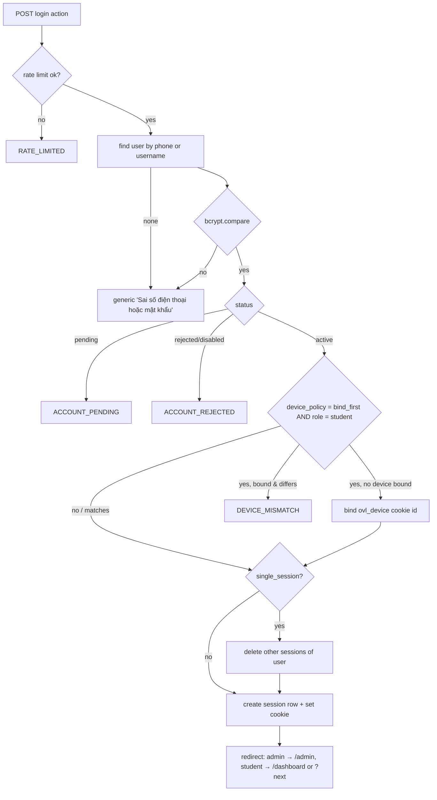

# 06 — Auth & Security

## 1. Authentication

### Login flow

- Unknown phone and wrong password give **the same message** (no account enumeration). Pending and rejected accounts are only reported **after** the correct password is entered.
- To keep timing roughly constant, still run `bcrypt.compare` against a dummy hash when the user isn't found.
- `?next=` must be a same-origin relative path starting with `/` and not `//`.

### Session
- Token: 32 random bytes from `crypto.getRandomValues`, base64url, in cookie `ovl_session` (`HttpOnly; Secure; SameSite=Lax; Path=/; Max-Age=30d`).
- DB stores only `sha256(token ‖ SESSION_PEPPER)`, so a DB leak doesn't leak usable sessions.
- Validation (`getCurrentUser`, wrapped in `cache()`): hash the cookie → one `SELECT … FROM sessions JOIN users` → reject if expired or the user isn't active → slide the expiry if fewer than 15 days remain.
- `proxy.ts` (edge) only checks that the cookie exists for `/dashboard`, `/lessons`, `/attempts`, `/admin`… and redirects to `/login?next=` otherwise. **It is not a security boundary.**

### Device policy (`settings.device_policy`) — dropped
> **Superseded (owner decision 01 §7 #3, 2026-09-28):** no device binding in v2. There is no `device_policy` setting, no `ovl_device` cookie and no `approved_device_id`. `single_session` stays. The text below is kept for history only.

- `off`: no checks.
- `bind_first`: the first successful student login stores `ovl_device` (a random ID cookie, 5-year expiry) in `users.approved_device_id`. Later logins with a different or missing device cookie get `DEVICE_MISMATCH` ("Tài khoản đã gắn với thiết bị khác. Liên hệ giáo viên để đổi thiết bị."). The admin resets it with one click.
- Honest limitation (write this in the admin UI tooltip): clearing browser data or switching browser counts as a new device. It deters casual account sharing, not determined sharing. v1's fingerprinting has the same limitation and adds privacy issues, so it's dropped.

### Passwords
- New passwords: at least 8 characters, not all digits, not the phone number. Checked with Zod on client and server.
- Hash: bcryptjs cost 10 (≈ 60–120 ms on a Vercel function). Login rate limits keep the CPU cost bounded (see 08).
- Admin reset: generates a 10-character temporary password and sets `must_change_password = true`. The student has to change it on next login.

## 2. Authorization matrix

| Resource / action | Visitor | Student (pending) | Student (active) | Admin |
|---|---|---|---|---|
| Landing, materials, share preview | ✅ | ✅ | ✅ | ✅ |
| Catalog, lesson overview | ❌ → login | ❌ | ✅ published only | ✅ all |
| Start/take attempt | ❌ | ❌ | ✅ own | ✅ (test mode, not rated) |
| Result page | ❌ | ❌ | ✅ own | ✅ any |
| Correct answers | ❌ | ❌ | ✅ own attempt **after submit** and only if `revealAnswers` allows | ✅ |
| Leaderboard | ❌ | ❌ | ✅ (phone never shown) | ✅ |
| Other student's profile | ❌ | ❌ | ✅ name/tier/rating only, if not private | ✅ full |
| Admin pages & actions | ❌ | ❌ | ❌ | ✅ |

Implemented as helpers in `src/features/auth/guards.ts`: `requireUser()`, `requireStudent()`, `requireAdmin()`, `assertOwnsAttempt(attempt, user)`. **Every** server action and route handler calls one of them on its first line. A unit test lists all exported actions and checks that each one is wrapped (see 11).

## 3. Anti-cheat / exam integrity
| Threat | Mitigation |
|---|---|
| Reading answers from network/devtools | The taking view never contains answers (ADR-004). `toPublicQuestion` has a unit test and an E2E network-inspection test |
| Forging a high score | The server grades. The client only sends raw answers |
| Submitting after the time limit | `deadline_at + 30 s` checked on the server; late submissions graded from the last save |
| Restarting to get easier pool questions | One `in_progress` attempt per lesson (unique index); `maxAttempts`; each start is logged |
| Sharing answers between students | Per-attempt question and option shuffle (seeded); pool selection; stats page can spot identical answer patterns (P2) |
| Switching tabs to search | Exam guard (lesson `examGuard`) records blur/visibility/fullscreen-exit events and blocked copy/cut/context-menu attempts with timestamps; the runner tells the student it is on. Events append only (a forged save can't erase them), shown to the admin on the result page (JSON until S6-04), never auto-penalized. A blocked-by-JS guard is advisory: a student can disable it, which is why nothing is scored from it |
| Copying questions | In test mode only: disable selection/copy/context menu. This is a deterrent, not a guarantee, and it's not applied anywhere else |
| Account sharing | Device policy + single session (optional) |

## 4. Web security checklist
- **CSRF:** Server Actions check the `Origin` header against the host, and cookies are `SameSite=Lax`. Route handlers that mutate check `Origin` explicitly (`assertSameOrigin(req)`).
- **XSS:** React escapes by default. Question text goes through a small whitelisting renderer (Markdown-lite → React elements, KaTeX HTML from `katex.renderToString` with `trust: false`, `strict: 'warn'`). **No `dangerouslySetInnerHTML` except KaTeX output.** AI explanations are rendered as Markdown with HTML disabled.
- **Headers** (`next.config.ts`, built by `src/lib/security-headers.ts`): `Content-Security-Policy` (default-src 'self'; img-src 'self' data: blob: <media-origin>; style-src 'self' 'unsafe-inline'; script-src 'self' 'unsafe-inline'; connect-src 'self' <media-origin>; object-src 'none'; base-uri 'self'; form-action 'self'; frame-ancestors 'none'; upgrade-insecure-requests), `X-Frame-Options: DENY`, `Cross-Origin-Opener-Policy: same-origin`, `Strict-Transport-Security`, `X-Content-Type-Options: nosniff`, `Referrer-Policy: strict-origin-when-cross-origin`, `Permissions-Policy: camera=(), microphone=(), geolocation=()`.
  - **No script nonce (decided in S1-08).** A nonce CSP forces every page to render per request, which breaks the static landing/theory pages and the prerendered shells that keep us inside the free quotas (02 §3, 08). Scripts are therefore `'self' 'unsafe-inline'`, and XSS protection rests on React escaping, the whitelisting Markdown/KaTeX renderer and having no `dangerouslySetInnerHTML` except KaTeX output and the constant theme boot script. Revisit if Next ships hash-based CSP for prerendered pages.
- **Secrets:** only in Vercel env vars. `src/lib/env.ts` fails the build if one is missing. No fallbacks in code. `server-only` imports on all DB and secret modules.
- **DB:** app role with least privilege. RLS enabled with no policies, so the anon REST API is useless. The old service key is **rotated** after migration.
- **Rate limits** (Postgres fixed window):
  | Key | Limit |
  |---|---|
  | login per IP | 20 / 10 min |
  | login per identifier | 5 / min, 20 / hour |
  | register per IP | 3 / hour |
  | startAttempt per user | 10 / min |
  | explainQuestion per user | 20 / day (cache hits are free) |
  | AI import per admin | 30 / day |

  The values live in `AUTH_LIMITS` (`src/features/auth/service.ts`). **Watch the per-IP limits in the pilot:** a whole class on one school Wi-Fi shares one public IP, so 3 registrations/hour and 20 logins/10 min per IP may be too tight on the first day. Raise them there if needed; the per-identifier limits are what stop password guessing.
- **Uploads:** admin only; content type in `image/webp|png|jpeg`; ≤ 2 MB after client resize; path generated by the server.
- **Logging:** never log passwords, tokens, answers or full phone numbers. `logger` masks phones as `09xx…123`.
- **Dependencies:** Renovate/Dependabot weekly; `pnpm audit` in CI.

## 5. Privacy
- Data held: full name, phone, DOB, class, attempt history, IP of sessions and attempts.
- Public surfaces show the name (optionally initials only, per privacy setting), tier and rating. Never phone or DOB.
- `exportMyData` returns JSON with the profile, attempts and rating history.
- A deletion request creates an admin task. On approval, the user row is deleted (cascade) and an audit entry keeps the action but no personal data.
- IP addresses are dropped from sessions on expiry and from attempts after 180 days.

## 6. Security tasks before go-live (tracked in 13, Sprint 9)
1. Rotate the v1 Supabase service key, DB password and session secret once v1 is decommissioned.
2. Make the v1 `lesson-images` bucket policy match v2 (public read, no public write).
3. Run the OWASP ZAP baseline scan against the preview deployment (free, Docker).
4. Manual test of the authorization matrix (Playwright suite `authz.spec.ts`).
5. Confirm that no response from any student route contains `"answer"` before submit (automated network-capture test).
