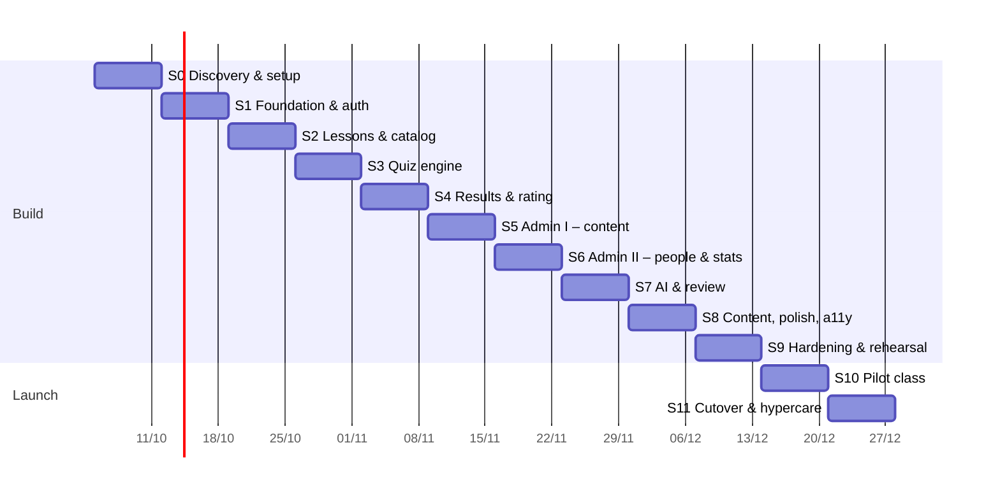

# 13 — Project Plan (Sprints & Tasks)

## 1. How we work

- **Team assumption:** 1 full-stack developer (AI-assisted) + the teacher as product owner and tester. Capacity ≈ **5 ideal dev-days per 1-week sprint**. **If you work part-time (~15 h/week), treat each sprint as 2 weeks.** The order and tasks stay the same.
- **Sprint length:** 1 week, Monday → Sunday.
  - Monday: plan (15 min). Pick tasks from this doc and create GitHub Issues from the task IDs.
  - Friday/Sunday: demo to the teacher on the preview URL (15 min), then a short retro note appended to §6.
- **Board:** GitHub Projects (free) with columns Backlog → Sprint → In progress → Review → Done. Each task ID below (e.g. `S3-04`) becomes one issue. PR titles reference it (`feat(attempts): S3-04 submit & grade`).
- **Estimates** are in ideal days (d). A sprint loads ≤ 4.5 d, leaving 10 % buffer for bugs.
- **Definition of Ready:** the task has acceptance criteria, its dependencies are done, and the design (from 07) is clear.
- **Definition of Done (every task):**
  1. Code merged to `main` via PR with CI green (lint, types, tests, build, bundle budget).
  2. Unit tests for any domain logic; E2E updated if a journey changed.
  3. Works on a 360 px phone and on desktop, in light and dark themes.
  4. No new axe serious/critical issues.
  5. Docs updated if behaviour or schema changed (this folder).
  6. Deployed to preview and checked by the dev. Checked by the teacher if it's user-facing.

## 2. Timeline overview

Proposed start **Mon 2026-10-05**. The dates assume a full-time pace.

| Milestone | Target | Exit criteria |
|---|---|---|
| **M0: Decisions locked** | end of S0 (11/10) | ADRs accepted, open questions in 01 §7 answered, v1 inventory recorded |
| **M1: Walking skeleton** | end of S1 (18/10) | Login/register on prod-like infra, design system live, CI green |
| **M2: A student can take a test** | end of S3 (01/11) | Migrated lesson → start → answer → submit → server score |
| **M3: Student feature parity** | end of S4 (08/11) | Results, rating, leaderboard, profile |
| **M4: Teacher parity** | end of S6 (22/11) | Teacher can run the class on v2 alone |
| **M5: Feature complete (P0)** | end of S8 (06/12) | All P0 in 01 done |
| **M6: Launch-ready** | end of S9 (13/12) | Load test passed, rehearsal migration verified, backups + monitoring live |
| **M7: Cutover** | S11 (≈ 21–27/12), or move it to the semester break / Tết (~early Feb 2027) if that's calmer | v2 serves all students, v1 read-only |

> **Scheduling note:** avoid cutting over during the end-of-semester exam weeks. If S11 lands on exam week, run the pilot longer and cut over at the semester break.

## 3. Sprint details

---

### Sprint 0: Discovery & setup (1 week)
**Goal:** lock decisions, measure v1, prepare accounts and repo.

| ID | Task | Est | Acceptance criteria |
|---|---|---|---|
| S0-01 | Answer the open questions in 01 §7 with the owner (commercial use, device policy, rating formula, quiz game, domain) | 0.25 | Answers written into 01 §7 |
| S0-02 | Review and accept the ADRs (or amend them) | 0.25 | ADR status = Accepted |
| S0-03 | v1 data inventory (10 §2 SQL): DB size, table sizes, counts, question-type census, storage size; check the Supabase region | 0.5 | Numbers recorded in 04 §6 and 10 §2 |
| S0-04 | v1 usage baseline from Vercel/Supabase: requests/day, peak hour, active students/week, quiz-game use | 0.25 | Numbers recorded in 08 §3 |
| S0-05 | Export anonymized fixtures: 10 lessons (all question types), 20 `rating_history` rows, 50 results | 0.5 | `tests/fixtures/v1/*.json` committed (no names or phones) |
| S0-06 | Create accounts/projects: GitHub repo (personal), Vercel project `onluyenvatly-v2` (region sin1, Fluid on), Supabase v2 project (Singapore), Neon staging, AI Studio keys, R2 bucket, Sentry, UptimeRobot | 0.5 | All reachable; secrets stored in Vercel/GitHub |
| S0-07 | Scaffold: Next.js latest + TS strict + Tailwind v4 + shadcn/ui init + Biome + Vitest + Playwright + pnpm; `src/` layout from 02 §5; `env.ts` with Zod | 0.75 | `pnpm dev` runs; `/api/health` responds on preview |
| S0-08 | CI workflow `ci.yml` (lint, typecheck, unit, build) + branch protection on `main` | 0.5 | A PR shows green checks; merging to main deploys |
| S0-09 | Rehearse domain switching and Instant Rollback with 2 throwaway Vercel projects | 0.25 | Steps confirmed and noted in 10 §6 |
| S0-10 | Write `AGENTS.md`/`CLAUDE.md` at repo root pointing to docs/14 conventions (for AI-assisted coding) | 0.25 | File committed |
| | **Total** | **4.0** | |

**Demo:** empty v2 app on its preview URL, CI badge, inventory numbers.

**Status (2026-09-28):**

| ID | Status | Notes |
|---|---|---|
| S0-01 | ✅ Done | Answers in 01 §7 (domain left open, not blocking) |
| S0-02 | ⏳ Owner | ADRs still `Proposed`; owner flips each to `Accepted` in `docs/adr/` |
| S0-03 | ⏳ Run script | `pnpm v1:inventory > tmp/v1-inventory.md` (read-only), then copy numbers into 04 §6 and 10 §2 |
| S0-04 | ⏳ Run script + dashboards | Same script gives results/week, active students, peak hour, burst size, quiz-game use. Requests/day comes from the v1 Vercel Usage tab. Record in 08 §3 |
| S0-05 | ⏳ Run script | `pnpm v1:fixtures` writes `tests/fixtures/v1/*.json`, anonymized; review the diff before committing |
| S0-06 | ⏳ Manual | Account checklist below |
| S0-07 | ✅ Done | Next 16 + TS strict + Tailwind v4 + shadcn config + Biome + Vitest + Playwright + pnpm; `src/` layout; `lib/env.ts` (Zod); `/api/health`. `/api/health` on preview still needs S0-06 |
| S0-08 | 🟡 Partial | `.github/workflows/ci.yml` (lint, types, unit + coverage, build, E2E smoke). Branch protection needs the GitHub repo |
| S0-09 | ⏳ Manual | Rehearsal checklist in 10 §6 |
| S0-10 | ✅ Done | `AGENTS.md` (+ `CLAUDE.md` → `@AGENTS.md`) |

S0-06 account checklist (put secrets only in Vercel/GitHub, never in the repo):
- [ ] GitHub repo under the **personal** account; push `main`
- [ ] Branch protection on `main`: require PR + the `Lint, types, unit, build` and `E2E smoke` checks, no force-push
- [ ] Vercel project `onluyenvatly-v2` from the repo; function region `sin1` (also set in `vercel.json`), Fluid compute on, Node 22
- [ ] Supabase v2 project in **Singapore (ap-southeast-1)**; note pooler (`:6543`) and direct URLs
- [ ] Neon project `staging` (Singapore region); URL → Vercel **Preview** env `DATABASE_URL`
- [ ] Google AI Studio: two Gemini keys (prod, staging)
- [ ] Cloudflare R2 bucket `onluyenvatly-backups` + API token; `age` key pair (private key offline)
- [ ] Sentry project (Next.js), UptimeRobot monitor on `https://onluyenvatly-v2.vercel.app/api/health`
- [ ] Generate `SESSION_PEPPER` and `CRON_SECRET` per environment; fill Vercel env vars per `.env.example`

---

### Sprint 1: Foundation & auth
**Goal:** design system, app shell, DB schema v1, working login/register/approval.

| ID | Task | Est | Depends | Acceptance criteria |
|---|---|---|---|---|
| S1-01 | Design tokens (07 §3) in `globals.css` `@theme`, light/dark, fonts via `next/font` (Vietnamese subset) | 0.5 | S0-07 | Contrast script passes; theme toggle works |
| S1-02 | `AppShell` (bottom tabs mobile / sidebar desktop), `PublicHeader`, `/dev/ui` component page | 0.75 | S1-01 | Matches 07 IA; keyboard navigable |
| S1-03 | Drizzle setup: `client.ts` (pooler, `prepare:false`, `max:5`), schema for `users`, `sessions`, `settings`, `rate_limits`, `audit_log`; first migration; `migrate.yml` | 0.75 | S0-06 | Migration applied to Neon + local; typed queries compile |
| S1-04 | Auth core: token/session create/validate/revoke, `getCurrentUser` (cached), guards, bcryptjs, phone normalization + unit tests | 1.0 | S1-03 | ≥ 95 % coverage on `features/auth/core` |
| S1-05 | `login`, `register`, `logout`, `logoutAll` actions; rate limiting helper (`rate-limit.ts`) + tests | 0.5 | S1-04 | Rate limits from 06 §4 enforced (integration test) |
| S1-06 | Login + register pages (single form, error states, pending screen), `proxy.ts` cookie redirect, `?next=` validation | 0.5 | S1-02, S1-05 | E2E journey 1 (without the admin approval part) passes |
| S1-07 | `seed.ts` (dev/e2e profiles, creates admin) | 0.25 | S1-03 | `pnpm seed` gives a working admin login |
| S1-08 | Security headers + CSP (06 §4) in `next.config.ts` | 0.25 | S0-07 | securityheaders.com grade A on preview |
| | **Total** | **4.5** | | |

**Demo:** register → see "chờ duyệt"; admin (seeded) logs in → empty admin shell.

---

### Sprint 2: Lessons, parser & catalog
**Goal:** the lesson data model, the text-format parser, and a fast catalog with real (migrated) lessons.

| ID | Task | Est | Depends | Acceptance criteria |
|---|---|---|---|---|
| S2-01 | Schema: `lessons`, `lesson_versions`, `media`; `unaccent` + `pg_trgm` extensions, `immutable_unaccent`, `search_text`, indexes | 0.5 | S1-03 | Migration applied; EXPLAIN shows index use on search |
| S2-02 | Zod `Question`/`LessonConfig` schemas + `toPublicQuestion` + tests (no `answer` leakage) | 0.5 | — | Tests pass incl. property test over random questions |
| S2-03 | Text-format **parser** + **serializer** (04 §3.3), round-trip tests over v1 fixtures, error positions (line/col) | 1.0 | S2-02 | 100 % of v1 fixture lessons round-trip |
| S2-04 | `MathText` server component (Markdown-lite + KaTeX `renderToString`, `trust:false`) + cache | 0.5 | — | Renders all fixture stems; no client KaTeX JS in the bundle |
| S2-05 | Migration script v0: users + lessons (+ versions) + media copy, idempotent by `legacy_id`; `migration-report.md` output | 1.0 | S2-01, S2-03 | Rehearsal on Neon: counts match v1, 0 schema failures or a documented list |
| S2-06 | Catalog queries (cached, tag `lessons`) + `/lessons` page: search, grade/chapter/tag filters, sort, URL state, "Xem thêm" pagination, skeletons, empty state | 0.75 | S2-04, S2-05 | LCP < 1.8 s on throttled Lighthouse; accent-insensitive search works |
| S2-07 | `/lessons/[id]` overview (meta cached, my attempts streamed) + legacy redirect `/lesson/:legacyId` | 0.25 | S2-06 | Old v1 link lands on the right lesson |
| | **Total** | **4.5** | | |

**Demo:** browse the 170 real lessons in v2 with fast search.

---

### Sprint 3: Quiz engine (core)
**Goal:** a student can take and submit a test with server-side grading. This is the most important sprint.

| ID | Task | Est | Depends | Acceptance criteria |
|---|---|---|---|---|
| S3-01 | Schema: `attempts`, `ratings`, `rating_events`, `mistakes` + indexes (incl. the unique in-progress partial index) | 0.25 | S2-01 | Migration applied |
| S3-02 | Domain: pool selection, seeded shuffle, points plan (remainder-cent), `grade()` for mcq/tf/short with number normalization; golden tests (11 §2) | 1.0 | S2-02 | All golden tests pass; ≥ 95 % coverage |
| S3-03 | `startAttempt` action (reuse in-progress, max attempts, deadline, items, rate limit) | 0.5 | S3-01, S3-02 | Integration test: two parallel starts → one attempt |
| S3-04 | Runner UI: `QuestionCard`, `McqOptions`, `TrueFalseTable`, `ShortAnswerInput`, navigator sheet, flag, one-per-screen and list modes, keyboard shortcuts | 1.25 | S2-04 | Usable at 360 px; axe clean |
| S3-05 | Runner state (Zustand + localStorage persistence), autosave queue (dirty-check, 30 s, `pagehide` beacon, retry/backoff, offline banner), `SaveIndicator`; `POST /api/attempts/[id]/save` | 0.75 | S3-03, S3-04 | Reload restores answers; offline → online syncs (E2E journey 2 part) |
| S3-06 | Timer (server `deadline_at`), warnings, auto-submit; `POST /api/attempts/[id]/submit`: lock, grade, store `earned/score`, idempotency, deadline + grace | 0.75 | S3-02, S3-05 | E2E journeys 2, 3, 5 pass |
| | **Total** | **4.5** | | |

**Demo:** the teacher takes a migrated test on a phone, reloads mid-way, submits, and sees the correct score.
**Also this sprint:** hallway test of the runner with 2–3 students (07 §8).

---

### Sprint 4: Results, rating & leaderboard
**Goal:** feedback loop parity with v1, with better UX.

| ID | Task | Est | Depends | Acceptance criteria |
|---|---|---|---|---|
| S4-01 | Rating domain (v1 and v2 formulas, tiers) + fixture tests vs v1 history; apply in the submit transaction; `rating_events` | 0.75 | S3-06 | v1 fixtures reproduced exactly |
| S4-02 | Mistakes upsert on submit (wrong → open, correct streak → resolved) | 0.25 | S3-06 | Integration test |
| S4-03 | Result page: `ScoreHero`, filters (all/wrong/right), `ReviewItem` with teacher explanation, reveal policy | 1.0 | S3-06 | Answers appear only as allowed by `revealAnswers` |
| S4-04 | Exam guard (blur/visibility/fullscreen events → `guard_events`; copy-block in runner only) | 0.5 | S3-05 | Events stored; admin can read them (JSON for now) |
| S4-05 | Leaderboard (cached 60 s; grade filter; weekly most-improved; sticky "me" row) | 0.75 | S4-01 | Matches v1 top 20 on migrated data |
| S4-06 | Dashboard: continue card, rating + mini chart, open mistakes count, recommended lessons (not-done lessons in the student's grade, ordered) | 0.75 | S4-01, S4-02 | Renders with ≤ 3 per-user queries |
| S4-07 | Profile (my history, rating chart lazy-loaded, accuracy by type) | 0.5 | S4-01 | Chart JS not in the dashboard bundle |
| | **Total** | **4.5** | | |

**Demo:** full student loop: dashboard → test → result → leaderboard.

---

### Sprint 5: Admin I, content authoring
**Goal:** the teacher can create, edit and publish lessons in v2.

| ID | Task | Est | Depends | Acceptance criteria |
|---|---|---|---|---|
| S5-01 | Admin shell + `/admin/lessons` DataTable: search, status filter, drag-reorder, duplicate, archive, delete (soft if attempts exist) | 0.75 | S1-02, S2-05 | Reorder persists; audit entries written |
| S5-02 | Editor: CodeMirror 6 (lazy), live parse → preview (`MathText`) → validation panel linking to lines, stats bar (counts per type, total points) | 1.25 | S2-03, S2-04 | Pasting a v1 lesson text shows an identical preview |
| S5-03 | Settings tab (`LessonConfig` form with Zod): time limit, shuffle, pool/byType, points per type, max attempts, reveal, rating, exam guard, tf scoring | 0.5 | S2-02 | Invalid combinations are blocked with messages |
| S5-04 | Save draft / publish / unpublish with the versioning policy (04 lesson_versions) + cache tag invalidation | 0.75 | S5-02 | E2E journey 7 passes (old attempt graded on old version) |
| S5-05 | Media: browser resize → WebP, `createUploadUrl`, paste/drag in the editor inserts ``, cover image | 0.75 | S2-01 | 5 MB PNG becomes < 200 KB WebP; no bytes through functions |
| S5-06 | Preview tab = the real runner in "preview" mode (answers shown), no attempt created | 0.25 | S3-04 | |
| | **Total** | **4.25** | | |

**Demo:** the teacher writes a new 10-question test with formulas and an image, publishes it, and a student takes it.

---

### Sprint 6: Admin II, people & insight
**Goal:** the teacher can run the class entirely from v2.

| ID | Task | Est | Depends | Acceptance criteria |
|---|---|---|---|---|
| S6-01 | Students: pending queue with bulk approve/reject; list with search/filter; detail page (attempts, rating, sessions) | 1.0 | S1-05 | E2E journey 1 full (with approval) |
| S6-02 | Student actions: reset password (temp, `must_change_password` flow), reset device, revoke sessions, disable, delete (cascade + audit), create admin | 0.75 | S6-01 | Authz spec covers every action |
| S6-03 | Global settings page (`settings` row, cached; device policy, single session, registration, AI, rating formula, announcement) | 0.5 | S1-03 | Changing policy takes effect on the next login |
| S6-04 | Results page: filters, attempt detail incl. guard events timeline, delete attempt + rating replay, CSV export | 0.75 | S4-01 | Replay equals a fresh computation (test) |
| S6-05 | Lesson statistics: distribution, per-question % correct, wrong-option breakdown, students per option (cached 5 min) | 0.75 | S3-06 | Numbers match a hand-computed fixture |
| S6-06 | Admin dashboard: pending count, active students 7 d, attempts/day chart, hardest questions this week, AI usage today | 0.5 | S6-05 | Loads < 1 s on migrated data |
| | **Total** | **4.25** | | |

**Demo:** the teacher approves new students, reviews a lesson's hardest question, and exports results.

---

### Sprint 7: AI & learning features
**Goal:** AI explanations (cached), AI import, and the mistakes-review loop.

| ID | Task | Est | Depends | Acceptance criteria |
|---|---|---|---|---|
| S7-01 | Gemini wrapper (timeouts, retries, token logging, global budget, kill switch) | 0.5 | S6-03 | Unit tests with a mocked client |
| S7-02 | `question_explanations` + `explainQuestion` (hash, cache, per-user limit, streaming into `ReviewItem`) + votes | 0.75 | S7-01, S4-03 | Second request for the same question makes no Gemini call (test) |
| S7-03 | Admin: pre-generate explanations for a lesson (batched, RPM-aware), review/edit page, 👎 queue | 0.5 | S7-02 | |
| S7-04 | AI import: signed upload to `imports/`, `POST /api/ai/import` streaming (DOCX via mammoth, PDF/image inline), stream into a new draft; cleanup in cron | 1.0 | S7-01, S5-04 | 3 real exam PDFs → drafts with ≤ 10 % manual fixes (teacher judgement) |
| S7-05 | Generate description + suggest tags buttons in the editor | 0.25 | S7-01 | |
| S7-06 | `/review`: mistakes bank (filters by chapter/type), start personalized practice (`review` attempts from mistakes), practice mode with `checkPracticeAnswer` | 1.0 | S4-02, S3-06 | E2E journey 6 passes |
| | **Total** | **4.0** | | |

**Demo:** a student reviews mistakes and gets an AI explanation; the teacher imports a PDF test.

---

### Sprint 8: Content, polish & accessibility
**Goal:** everything around the core: public pages, settings, redirects, quality pass.

| ID | Task | Est | Depends | Acceptance criteria |
|---|---|---|---|---|
| S8-01 | Landing page (honest features, how it works, chapters, CTA), static, OG image | 0.75 | S1-02 | Lighthouse ≥ 95 performance on mobile |
| S8-02 | Theory materials: convert `materials/**` → MDX pages with navigation by grade/chapter; external links marked | 0.75 | — | All v1 material entries present |
| S8-03 | Gallery (WebP handouts), share page `/share/lessons/[id]` (ISR, 2-question preview, OG image) | 0.5 | S2-07 | Share link preview renders in Zalo/Facebook debugger |
| S8-04 | Student settings: profile, avatar upload, change password, sessions/devices list, privacy (initials on leaderboard), export data, deletion request | 0.75 | S1-05 | |
| S8-05 | All legacy redirects (05 §1) + `robots.ts`, `sitemap.ts`, `manifest.ts` (PWA install) | 0.25 | S2-07 | Redirect table test passes |
| S8-06 | Accessibility pass: axe in all E2E, keyboard-only walkthrough, TalkBack on Android for the runner; fix issues | 0.5 | — | 0 serious/critical axe issues |
| S8-07 | Error/empty/loading states audit + Vietnamese copy review with the teacher (`messages.ts`) | 0.5 | — | Every list and form has all states |
| | **Total** | **4.0** | | |

**Demo:** full walkthrough as a new visitor → student → teacher.

---

### Sprint 9: Hardening & rehearsal
**Goal:** prove speed, capacity, safety and a clean migration.

| ID | Task | Est | Depends | Acceptance criteria |
|---|---|---|---|---|
| S9-01 | k6 load test (11 §5) at 100 VUs, then 300 VUs; fix bottlenecks | 1.0 | S3-06 | Thresholds met; DB verification after the run passes |
| S9-02 | Performance pass: Lighthouse CI budgets, bundle check, prefetch audit, cache-hit review in Vercel logs | 0.5 | — | All budgets in 08 §1 met |
| S9-03 | Security pass: authz spec complete, answer-leak network test, ZAP baseline, dependency audit, `server-only` audit, secrets review | 0.75 | — | 0 high findings open |
| S9-04 | Backups (`backup.yml` → R2, encrypted) + first **restore drill** into Neon | 0.5 | S0-06 | Restored DB passes the sanity checks |
| S9-05 | Monitoring: Sentry, UptimeRobot, `quota-check.yml`, Vercel usage alerts, cron `/api/cron/daily` | 0.5 | — | A test alert arrives |
| S9-06 | Migration script complete (results → attempts, legacy versions, rating events, mistakes rebuild) + `verify-migration.ts`; **full rehearsal** into the v2 prod project | 1.25 | S2-05 | Verification (10 §7) all green; report reviewed with the teacher |
| | **Total** | **4.5** | | |

**Milestone M6: launch-ready.**

---

### Sprint 10: Pilot
**Goal:** real students use v2 on real tests before everyone moves.

| ID | Task | Est | Acceptance criteria |
|---|---|---|---|
| S10-01 | Pilot setup: one class (~20–40 students) uses `onluyenvatly-v2.vercel.app` with migrated accounts (rehearsal data); the teacher assigns 2–3 tests there | 0.25 | Students can log in with their v1 password |
| S10-02 | Feedback channel (Zalo group or Google Form) + in-app "Góp ý" link | 0.25 | |
| S10-03 | Daily triage and fixes from the pilot (budget) | 3.0 | All P0/P1 bugs fixed |
| S10-04 | Pilot review: metrics (LCP, errors, quota usage), teacher sign-off | 0.25 | Go/No-go recorded in §6 |
| S10-05 | Student-facing announcement + short guide (images) for the new site | 0.25 | Ready to send |
| | **Total** | **4.0** | |

Pilot data note: the final migration upserts only rows with `legacy_id`. Attempts made natively in v2 during the pilot survive the final migration.

---

### Sprint 11: Cutover & hypercare
**Goal:** move everyone to v2 safely.

| ID | Task | Est | Acceptance criteria |
|---|---|---|---|
| S11-01 | Execute the cutover runbook (10 §6) in a low-traffic window | 0.5 | All steps ticked |
| S11-02 | Post-cutover smoke tests + verification script | 0.25 | Green |
| S11-03 | Hypercare: watch Sentry, quotas and messages daily for 7 days; hotfixes | 2.0 | No P0 open at the end of the week |
| S11-04 | Decommission v1 after 14 days: rotate keys, final dump, pause the v1 Supabase project, archive the repo | 0.25 | Done (can happen in week 3) |
| S11-05 | Retrospective + update docs to "as built"; create the post-launch backlog | 0.5 | Docs match reality |
| | **Total** | **3.5** | |

---

## 4. Post-launch backlog (prioritize after launch)
| ID | Item | From |
|---|---|---|
| B-01 | Chapters/collections and a learning path per grade | L6 |
| B-02 | Adaptive quiz builder (questions from recent lessons weighted by class error rate) | M10 |
| B-03 | Multiple teachers with per-class ownership | A8+ |
| B-04 | Excel export with formatting; per-class reports | M12 |
| B-05 | Quiz game mode (only if v1 usage justifies it) | R10 |
| B-06 | Suspicious-similarity report (identical answer patterns) | 06 §3 |
| B-07 | Light gamification (daily streak, weekly goal) with no new quotas | — |
| B-08 | Offline-first runner via service worker (download a test before a class with bad Wi-Fi) | — |
| B-09 | AI quality check of lessons | AI6 |

## 5. Risk register
| # | Risk | Prob. | Impact | Mitigation | Owner |
|---|---|---|---|---|---|
| R1 | Free-tier quota exceeded (Vercel Fast Origin Transfer, Supabase egress) | M | H | Budget in 08, daily quota check, 60 % rule, fallback R2/Pro month | Dev |
| R2 | Site is "commercial" → Vercel Hobby not allowed | M | H | Decide in S0-01; exit plan in ADR-001 | Owner |
| R3 | Migration mismatches (edited lessons vs old results) | M | M | Legacy versions (10 §5), rehearsal in S9, verification script | Dev |
| R4 | Supabase pause during holidays | H (without mitigation) | H | Daily cron + nightly backup touch the DB; UptimeRobot alert | Dev |
| R5 | Gemini free tier changes or model deprecated | H | L | Env-configurable model, cache, kill switch | Dev |
| R6 | Schedule slips (solo dev, school calendar) | H | M | 10 % buffer per sprint; P1/P2 can slip; pilot can extend; cutover at the semester break | Dev/Owner |
| R7 | Students confused by the new UI | M | M | Pilot, guide, keep URLs and logins identical | Owner |
| R8 | Next.js caching API churn | M | L | Pin versions, `cached()` wrapper (ADR-005) | Dev |
| R9 | Data loss (no backups on Free) | L | H | Nightly encrypted backups + monthly restore drill | Dev |
| R10 | Exam cheating reports undermine trust | L | M | Server grading, no answer leakage, guard events | Dev |

## 6. Sprint log (append each week)
| Sprint | Dates | Planned d | Done d | Demo notes | Retro: keep / change |
|---|---|---|---|---|---|
| S0 | 2026-09-28 → | 4.0 | 1.5 (S0-01, S0-07, S0-10, most of S0-08; scripts for S0-03/04/05) | | |
| S1 | | 4.5 | | | |
| … | | | | | |
