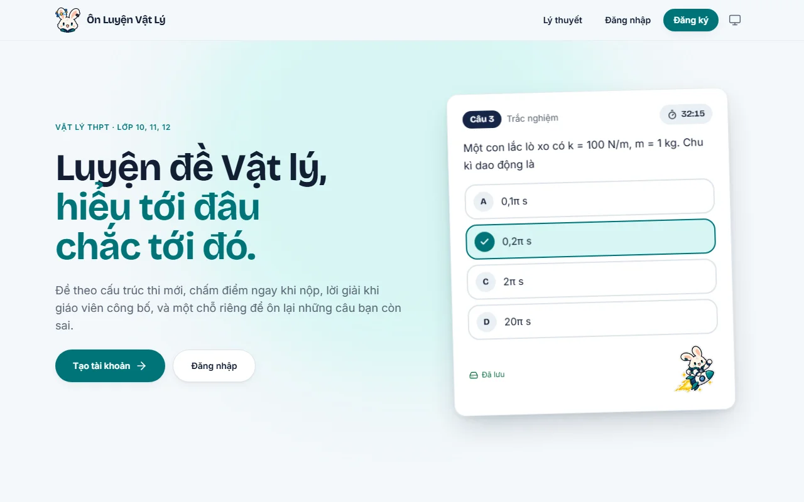
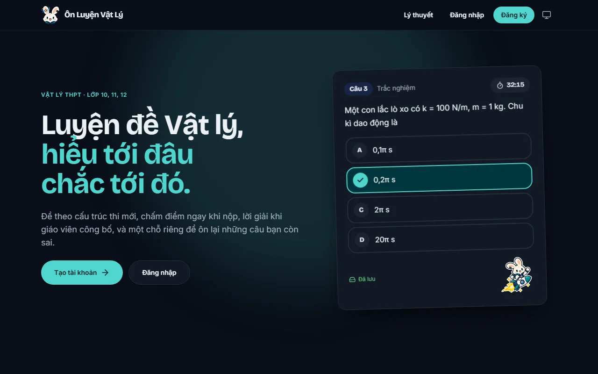
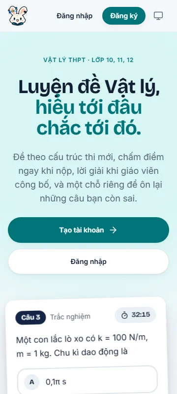
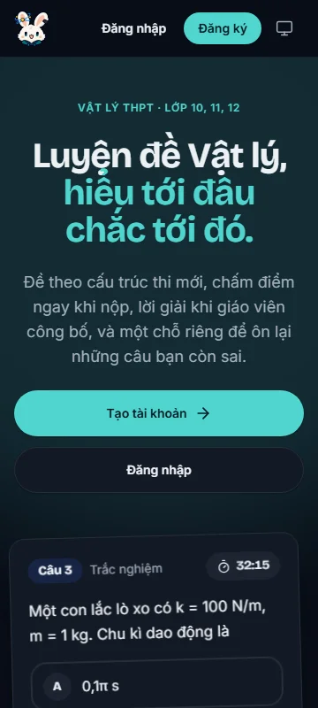

# Lagoon redesign review

Production-build captures, 2026-09-30. Mobile viewport: 360×800; desktop: 1280×800.

| | Light | Dark |
|---|---|---|
| Desktop |  |  |
| Mobile |  |  |

Validation: lint, typecheck, all 1,040 unit tests (`--maxWorkers=2`), token contrast checks and production build pass. The first complete desktop/mobile E2E run identified six contrast failures; fixes cover opaque button hover colors, teal on pale surfaces, entrance opacity and the floating tab bar over the result hero. The full rerun was still running when this PR was opened; CI is the merge gate.

Local Lighthouse mobile report: performance 83, accessibility 100, CLS 0. The S8-01 performance target of 95 remains open, primarily around font loading. Lighthouse produced the report but its Windows temporary Chrome-profile cleanup failed afterward. This is a local measurement, not deployed or physical-device acceptance.

The base merge adds the S8 theory pages and share/account endpoints. This pass preserves them and adds the landing page, custom 404, and social preview; it focuses the visual overhaul on the existing onboarding, study, and admin screens.
